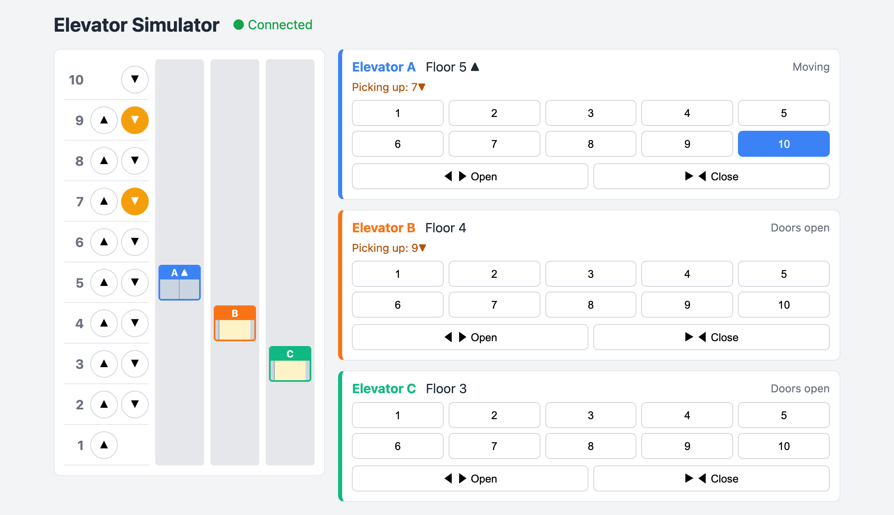

# Elevator Simulator — Mô phỏng thang máy

Web app mô phỏng **3 thang máy chạy song song trong toà nhà 10 tầng**.

- **Server (Node.js):** chứa toàn bộ logic — thang chạy, dừng, mở/đóng cửa, chọn thang nào đi đón.
- **Client (React):** vẽ toà nhà, gửi lệnh khi người dùng bấm nút.
- Hai bên nói chuyện qua **Socket.IO** (kết nối thời gian thực).

Mỗi **nhịp** (1 giây), mỗi thang đi được 1 tầng.



*Nút ▼ ở tầng 9 và tầng 7 sáng vì có người đang chờ đi xuống. Thang A đang đi lên tầng 10 (nút 10 sáng) và được giao đón người ở tầng 7 (`Picking up: 7▼`). Thang B đang mở cửa ở tầng 4, sau đó sẽ đi đón người ở tầng 9. Thang C đang mở cửa ở tầng 3.*

---

## Chạy dự án

Cần **Node.js 20.19+** (hoặc 22.12+).

```bash
# Terminal 1 — server (http://localhost:3000)
cd server
npm install
npm run dev

# Terminal 2 — client (http://localhost:5173)
cd client
npm install
npm run dev
```

Mở http://localhost:5173.

```bash
cd server && npm test   # chạy test
```

### Biến môi trường (không bắt buộc)

| File | Biến | Mặc định | Ý nghĩa |
|---|---|---|---|
| `server/.env` | `PORT` | `3000` | Cổng server |
| `server/.env` | `STEP_INTERVAL_MS` | `1000` | Độ dài một nhịp (ms) |
| `server/.env` | `CLIENT_ORIGIN` | `http://localhost:5173` | Địa chỉ client được phép kết nối |
| `client/.env` | `VITE_SERVER_URL` | `http://localhost:3000` | Địa chỉ server |

Client luôn chạy ở cổng 5173 (nếu cổng bận, Vite báo lỗi thay vì tự đổi cổng — vì server chỉ cho phép đúng địa chỉ này).

> **Lưu ý khi đổi `STEP_INTERVAL_MS`:** cabin trên giao diện trượt giữa hai tầng trong **1 giây** (`transition: bottom 1s` trong `client/src/index.css`), khớp với nhịp mặc định. Đổi độ dài nhịp ở server thì sửa luôn con số `1s` này cho bằng nhau, nếu không cabin sẽ trượt lệch nhịp.

---

## Cách dùng

- **Ở mỗi tầng:** bấm ▲ hoặc ▼ để gọi thang. Nút sáng màu cam khi đang chờ, tắt khi thang tới.
- **Thang nào tới đón bạn?** Thẻ của thang được giao hiện dòng **Picking up**, ví dụ `Picking up: 5▲`.
- **Trong từng thang** (bảng bên phải): khi thang tới, bấm số tầng để chọn nơi muốn đến; **Open** giữ cửa mở lâu hơn, **Close** đóng cửa ngay.

### Luật dừng theo hướng (theo đề bài)

Thang đang đi hướng nào thì chỉ dừng đón người **đi cùng hướng đó**.

> Bạn ở tầng 5, thang đang đi lên từ tầng 1 tới tầng 10.
> - Bấm ▲ → thang **dừng** ở tầng 5 đón bạn.
> - Bấm ▼ → thang **không dừng**; nó lên tới 10, quay xuống rồi mới đón bạn
>   (hoặc hệ thống điều một thang khác đang rảnh tới đón nếu nhanh hơn).

---

## Cấu trúc thư mục

```
server/src/
├── index.js              # khởi động server + chạy nhịp thời gian mỗi giây
├── server.js             # tạo Express + Socket.IO
├── socket.js             # nhận lệnh từ trình duyệt, gửi trạng thái về
└── models/               # logic thang máy (các class OOP)
    ├── Building.js       # toà nhà: quản lý 3 thang, chọn thang đi đón
    ├── Elevator.js       # một thang: tầng, hướng, danh sách tầng cần ghé
    ├── Direction.js      # UP / DOWN
    └── states/           # trạng thái của thang
        ├── ElevatorState.js   # lớp cha
        ├── WaitingState.js    # đứng yên, cửa đóng
        ├── MovingState.js     # đang chạy
        └── DoorOpenState.js   # đang mở cửa

client/src/
├── main.jsx              # điểm khởi động React
├── App.jsx               # nhận trạng thái từ server, gửi lệnh lên server
├── socket.js             # kết nối Socket.IO
├── constants.js          # chiều cao 1 tầng, màu từng thang
└── components/
    ├── Building.jsx      # hình toà nhà: các tầng + các trục thang
    ├── FloorButtons.jsx  # nút ▲ ▼ ở mỗi tầng
    ├── ElevatorShaft.jsx # một trục thang + cabin
    └── ElevatorPanel.jsx # bảng nút của một thang (chọn tầng, mở/đóng cửa)
```

---

## Luồng hoạt động

```
  Trình duyệt (React)                              Server (Node.js)
 ┌──────────────────────┐   callElevator, selectFloor,   ┌───────────────────────┐
 │  bấm nút             │ ── openDoor, closeDoor ──────► │ socket.js             │
 │                      │                                │   └► Building          │
 │  vẽ lại giao diện    │ ◄──────── 'state' ──────────── │        └► Elevator     │
 └──────────────────────┘   (mỗi giây + sau mỗi lệnh)    └───────────────────────┘
```

1. Mỗi giây, `index.js` gọi `building.step()` → mọi thang đi một bước → server gửi trạng thái mới cho tất cả trình duyệt.
2. Người dùng bấm nút → client gửi lệnh → server xử lý → gửi trạng thái mới ngay.
3. Client **không tự tính gì**: chỉ vẽ lại theo trạng thái server gửi xuống.

---

## OOP trong dự án

Đề bài yêu cầu áp dụng **đóng gói, kế thừa, đa hình**. Cả ba nằm trong `server/src/models/`.

### Đóng gói (encapsulation)

Dữ liệu của class được khai báo **private** bằng dấu `#`. Code bên ngoài không đọc/sửa trực tiếp được, chỉ đi qua hàm public.

```js
// (rút gọn từ Elevator.js để minh hoạ)
export class Elevator {
  #floor;                 // private: bên ngoài không gán được elevator.#floor = 99
  #stops = new Set();

  get floor() {           // chỉ cho ĐỌC
    return this.#floor;
  }

  selectFloor(floor) {    // muốn thêm tầng thì phải gọi hàm này
    this.#stops.add(floor);
  }
}
```

Tương tự: `Building` giữ `#elevators` private và tự kiểm tra dữ liệu (`#checkFloor`, `#checkDirection`) trước khi thay đổi gì.

### Kế thừa (inheritance)

Ba trạng thái của thang cùng **kế thừa** lớp cha `ElevatorState`:

```
ElevatorState            ← lớp cha: step(), pressOpen(), pressClose()
├── WaitingState         ← đứng yên, cửa đóng
├── MovingState          ← đang chạy
└── DoorOpenState        ← đang mở cửa
```

Lớp cha viết sẵn `pressOpen()` / `pressClose()` là **không làm gì**. Lớp con nào cần thì viết lại (override), lớp nào không cần thì dùng luôn của cha — ví dụ `MovingState` không viết lại, nên bấm mở cửa khi đang chạy sẽ không có tác dụng.

### Đa hình (polymorphism)

`Elevator` giữ một biến `#state` và chỉ việc **gọi hàm của trạng thái hiện tại**, không cần `if/else` kiểm tra đang ở trạng thái nào:

```js
step()       { this.#state.step(this); }
pressOpen()  { this.#state.pressOpen(this); }
pressClose() { this.#state.pressClose(this); }
```

Cùng một lời gọi, mỗi trạng thái làm một việc khác nhau:

| Lời gọi | `WaitingState` | `MovingState` | `DoorOpenState` |
|---|---|---|---|
| `step()` | có việc thì bắt đầu chạy | đi 1 tầng, tới nơi thì dừng | đếm ngược 3 nhịp rồi đóng cửa |
| `pressOpen()` | mở cửa | không làm gì | giữ cửa mở thêm |
| `pressClose()` | không làm gì | không làm gì | đóng cửa ngay |

Khi cần đổi trạng thái, state tự gọi `elevator.setState(new ...State())`.

---

## Logic thang máy

### Một thang nhớ những gì? (`Elevator.js`)

| Dữ liệu | Ý nghĩa |
|---|---|
| `#floor` | tầng hiện tại |
| `#direction` | hướng đang đi: `UP` / `DOWN` |
| `#state` | trạng thái: Waiting / Moving / DoorOpen |
| `#stops` | tầng khách **trong thang** đã bấm |
| `#upCalls` | tầng có người chờ ở sảnh muốn đi **lên** |
| `#downCalls` | tầng có người chờ ở sảnh muốn đi **xuống** |

### Khi nào thang dừng? (`shouldStopHere`)

Thang dừng ở tầng hiện tại nếu:

1. có khách trong thang muốn ra ở tầng này, **hoặc**
2. có người chờ đi **cùng hướng** thang đang đi, **hoặc**
3. có người chờ đi **ngược hướng** và phía trước đã hết việc (thang sắp quay đầu, tiện đón luôn).

### Mỗi nhịp khi đang chạy (`MovingState.step`)

1. Hết việc → chuyển sang đứng chờ.
2. Có việc ngay tầng này → dừng, mở cửa.
3. Phía trước hết việc → quay đầu.
4. Đi 1 tầng; nếu tầng mới cần dừng → dừng, mở cửa.

### Chọn thang nào đi đón? (`Building.#estimateCost`)

Khi có người bấm ▲▼, toà nhà ước lượng **mỗi thang phải đi bao nhiêu tầng nữa mới tới đón được**, rồi chọn thang có số nhỏ nhất:

| Tình huống của thang | Chi phí |
|---|---|
| 1. Đang rảnh | khoảng cách tới tầng gọi |
| 2. Đang đi cùng hướng khách muốn, tầng khách ở phía trước | khoảng cách tới tầng gọi (tiện đường) |
| 3. Còn lại (đi ngược hướng, hoặc đã đi qua) | đi tới tầng xa nhất đang cần tới → quay đầu → về tầng gọi |

Ví dụ: A ở tầng 4 đang lên tầng 10, B rảnh ở tầng 1, người ở tầng 5 bấm ▼.
- A: phải lên 10 rồi quay về 5 = 6 + 5 = **11 tầng**
- B: đi thẳng lên = **4 tầng** → chọn **B**.

Thêm hai quy tắc nhỏ:
- Một nút gọi chỉ giao cho **một** thang (bấm lại nút đang sáng không gọi thêm thang).
- Thang **đang mở cửa ngay tầng gọi** mà đi được hướng khách muốn → chỉ giữ cửa cho khách vào, không điều thang khác tới.

---

## Giao tiếp client ↔ server

### Server gửi xuống: sự kiện `state`

Gửi mỗi giây, sau mỗi lệnh, và ngay khi trình duyệt vừa kết nối:

```js
{
  floorCount: 10,
  elevators: [
    {
      id: 'A',
      floor: 3,
      direction: 'UP',        // 'UP' | 'DOWN'
      state: 'MOVING',        // 'WAITING' | 'MOVING' | 'DOOR_OPEN'
      stops: [7],             // tầng khách trong thang đã bấm
      upCalls: [5],           // tầng thang này được giao đón người đi lên
      downCalls: []           // tầng thang này được giao đón người đi xuống
    },
    // ... B, C
  ],
  upCalls: [5],               // nút ▲ đang sáng ở các tầng
  downCalls: [8]              // nút ▼ đang sáng ở các tầng
}
```

Xem nhanh trên trình duyệt: http://localhost:3000/api/state

### Client gửi lên: lệnh

| Sự kiện | Dữ liệu | Khi nào |
|---|---|---|
| `callElevator` | `{ floor, direction }` | bấm ▲▼ ở sảnh |
| `selectFloor` | `{ elevatorId, floor }` | bấm số tầng trong thang |
| `openDoor` | `{ elevatorId }` | bấm Open |
| `closeDoor` | `{ elevatorId }` | bấm Close |

Server trả lời `{ ok: true }` hoặc `{ ok: false, error: '...' }`. Lệnh sai (tầng không tồn tại, bấm ▼ ở tầng 1...) chỉ bị báo lỗi, server **không** dừng.

---

## Frontend

- `App.jsx` dùng `useState` giữ trạng thái toà nhà, `useEffect` để nghe sự kiện `state` từ server.
- Bấm nút → `sendCommand()` gửi lệnh. Lỗi (nếu có) hiện ở góc dưới, tự ẩn sau 3 giây.
- Nút sáng / tắt dựa **hoàn toàn** vào dữ liệu server gửi, client không tự bật.
- Cabin được đặt bằng `bottom = (tầng - 1) × chiều cao 1 tầng`; CSS `transition: bottom 1s` làm nó trượt mượt giữa các tầng.
- Mất kết nối → hiện "Disconnected" và khoá mọi nút; server bật lại thì tự kết nối lại.

---

## Test

```bash
cd server
npm test
```

23 test (`node:test`, không cần cài thêm thư viện). Các test đánh dấu **[ĐỀ BÀI]** kiểm tra đúng các tình huống trong đề.

| File | Kiểm tra |
|---|---|
| `Elevator.test.js` | đi lên/xuống, thứ tự dừng, cửa tự đóng, giữ cửa / đóng ngay, dừng đón cùng hướng, không dừng người ngược hướng |
| `Building.test.js` | toà nhà 10 tầng 3 thang, từ chối lệnh sai, nút sáng/tắt, chọn thang hợp lý |
| `socket.test.js` | kết nối nhận trạng thái, gửi lệnh nhận `ok`, lệnh sai không làm sập server |
